# <p align="center">ft_transcendence (a ping pong website)</p>

## Description
"Oh, finally! I just finished the 42 common core, and thanks to ft_transcendence, but it's just an introduction to another chapter in the web story. It is just the beginning" - me.

ft_transcendence is a collaborative project that explores the world of building a web application from design to production. The project is about building a ping pong real-time application, using NestJs for the backend, NextJs framework for the frontend, and Prisma with PostgreSQL for the database. The project started by designing each interface of the application using Figma, which is a great tool to explore the design world.

It is great to have a solid database for the application, that's why Prisma is here. Prisma is an ORM (Object-Relational Mapping) tool for Node.js and TypeScript that simplifies database access and manipulation by providing a type-safe and intuitive API for interacting with databases. Prisma uses PostgreSQL as its primary database; also, it can translate queries written in TypeScript into SQL queries. This is what happens in the migration process: Prisma uses schema files to generate database models and queries for interacting with the database and provides a powerful migration system to manage changes to the database schema.

"In a restaurant, customers don't prepare their meals themselves; that's why there are waiters and chefs to serve them. The meal is expertly prepared in the kitchen before being elegantly presented to the customer at their table by the waiter."

The same scenario happens in a web application. There are several APIs to serve the customer by sending requests from the frontend to the backend. This type of communication uses the HTTP protocol, and for this, Axios exists. Axios is a popular JavaScript library used for making HTTP requests. Axios's role is to reach out to all the API endpoints on the backend by sending requests to it with specifying the HTTP method (GET, POST, PUT, DELETE) and the URL of the API endpoint you want to interact with. After sending a request, the backend processes the request and returns a response to the frontend.

The Application's backend is written in NestJs framework, which is a Node.js-based framework, and for real-time communication, there are WebSocket servers.

For the DevOps side and to containerize the application, there are three containers, each container runs a different service. A container for the backend that runs the NestJs server, a container that runs the frontend application, and a container that runs the PostgreSQL database. To combine all those three containers together, there is docker-compose to make all the three containers interact with each other.

##  How to Install and Run the Application
+ To run the application, you need to add and env file at the root of the repository, the env file content is similar to this example:

```
    DATABASE_URL="postgresql://postgres:12345@db:5432/nestjs?schema=public"
    BACK_URL="http://localhost:3001"
    FRONT_URL="http://localhost:3000"
    POSTGRES_USER=postgres
    POSTGRES_PASSWORD=12345
    POSTGRES_DB=nestjs
```
+ Also need to add another env_local file to the frontEnd folder and it's content is similar to this:

```
    NEXT_PUBLIC_BACK_URL=http://localhost:3001
```

> [!TIP]
> It is highly recommended to to install node js version 20 and to have docker with docker-compose installed on your machine.

+ After adding the environement files, you can run the application by using make command, and wait until the application is ready to use.

```
    make
```

## Preview

> User

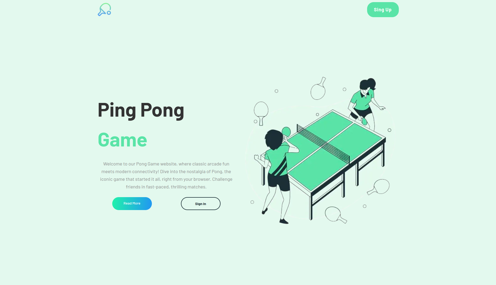
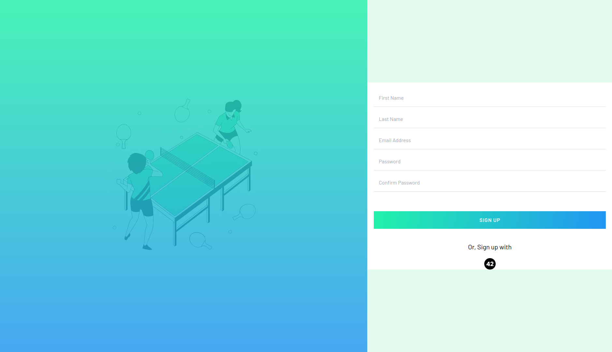
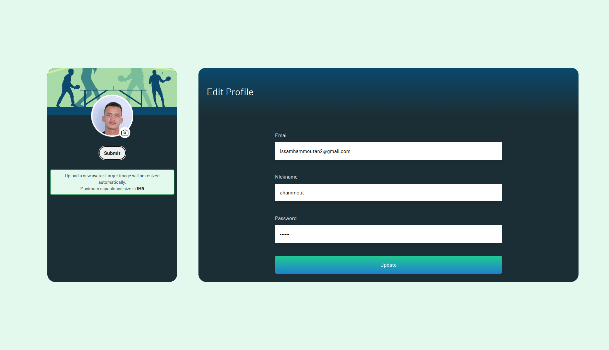
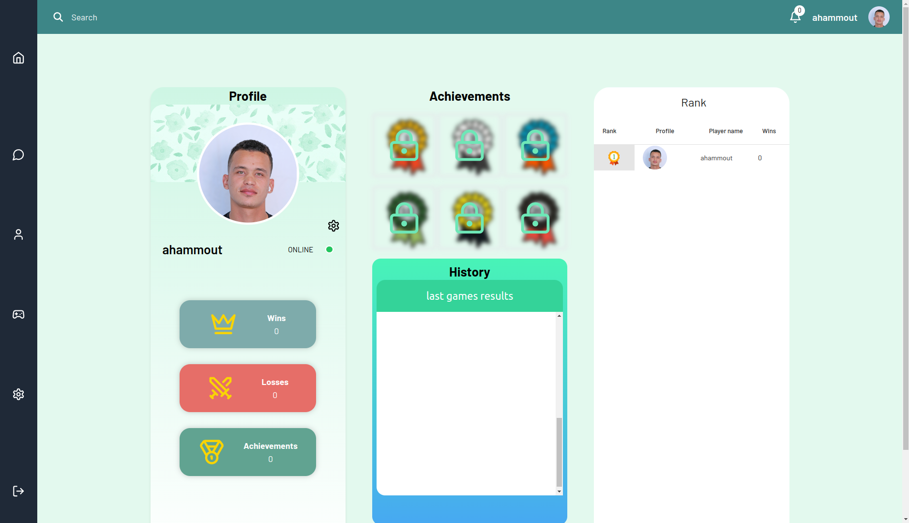
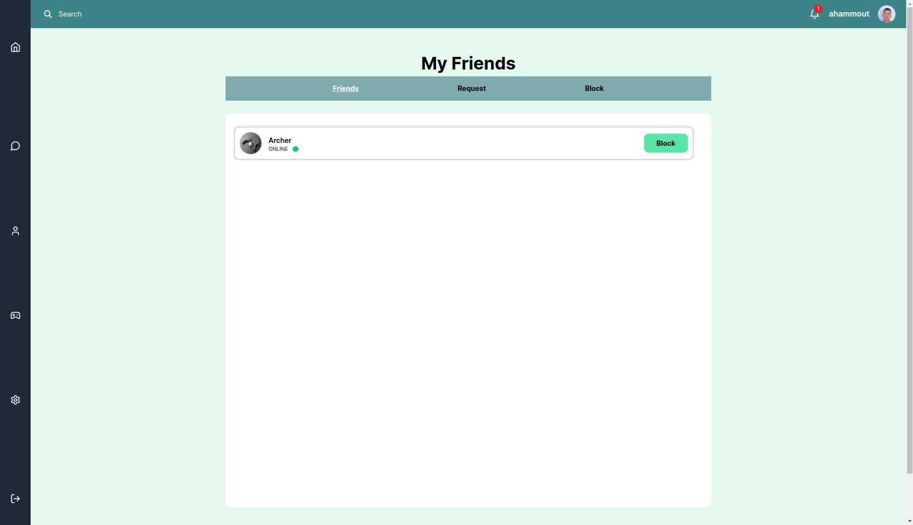
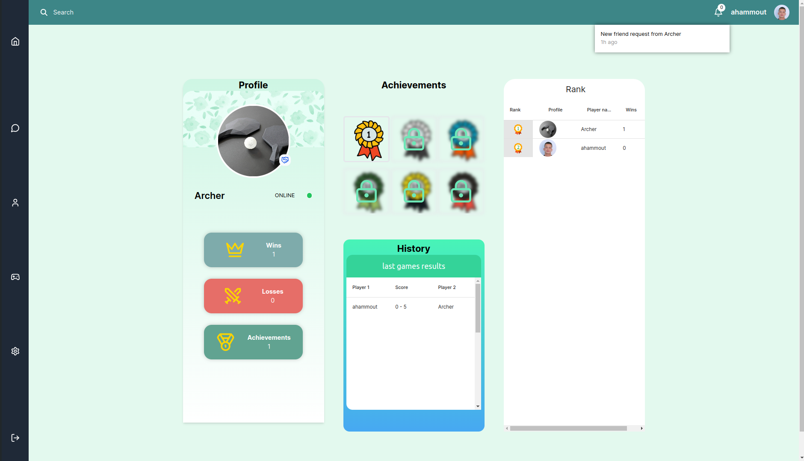


> Game


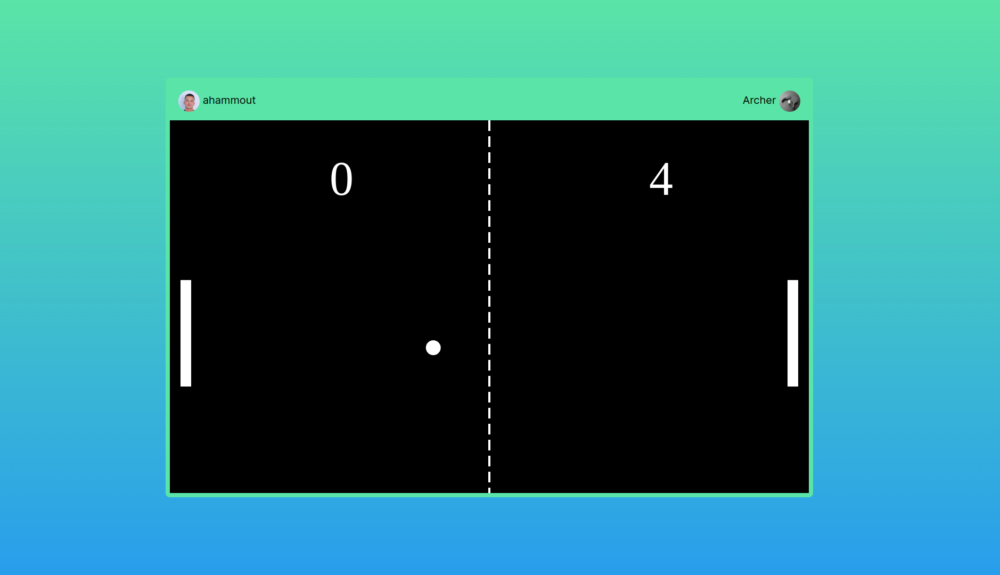


> Chat

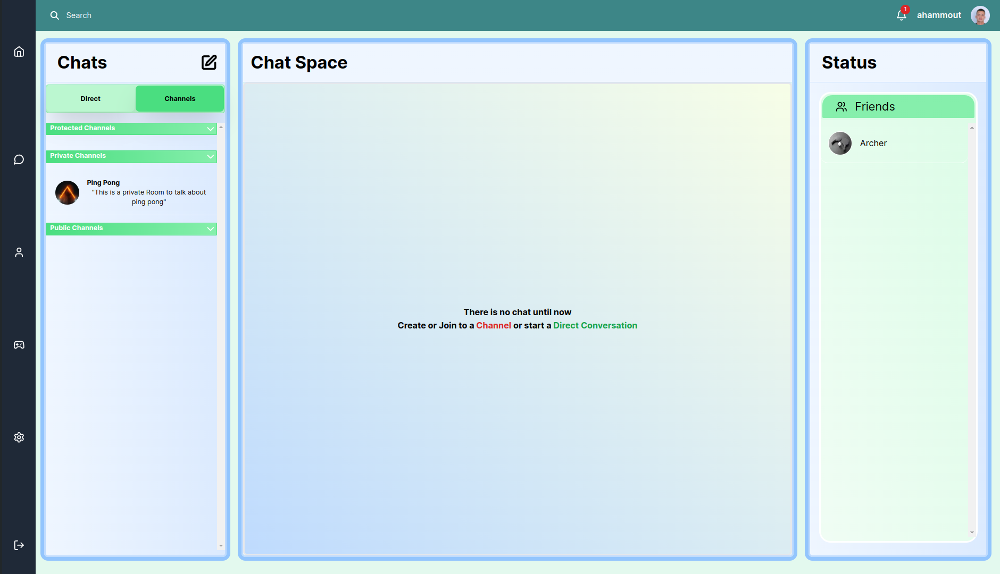
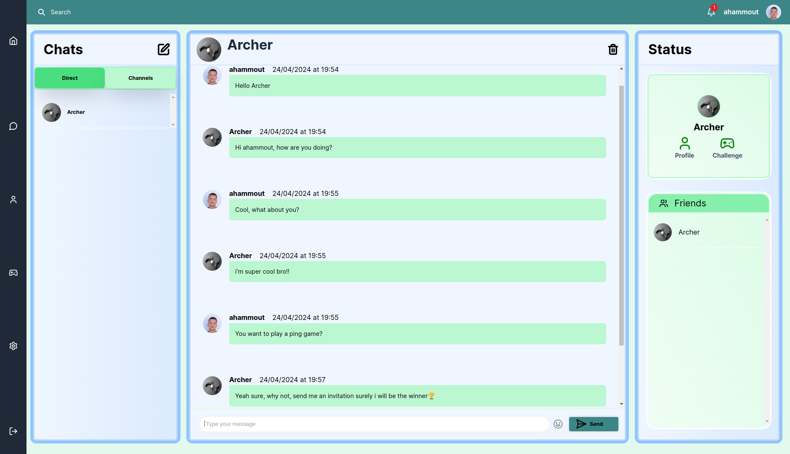
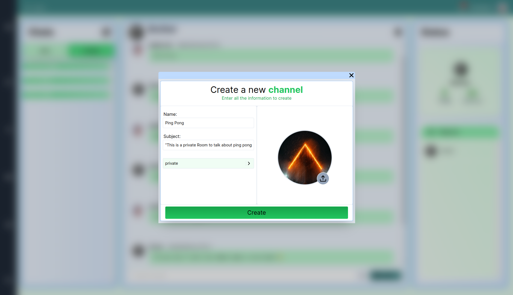
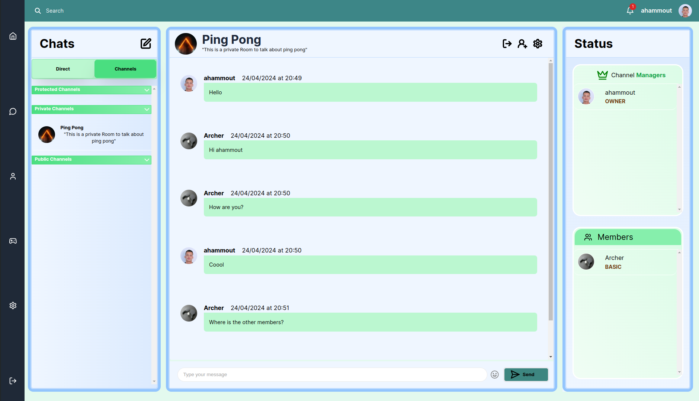
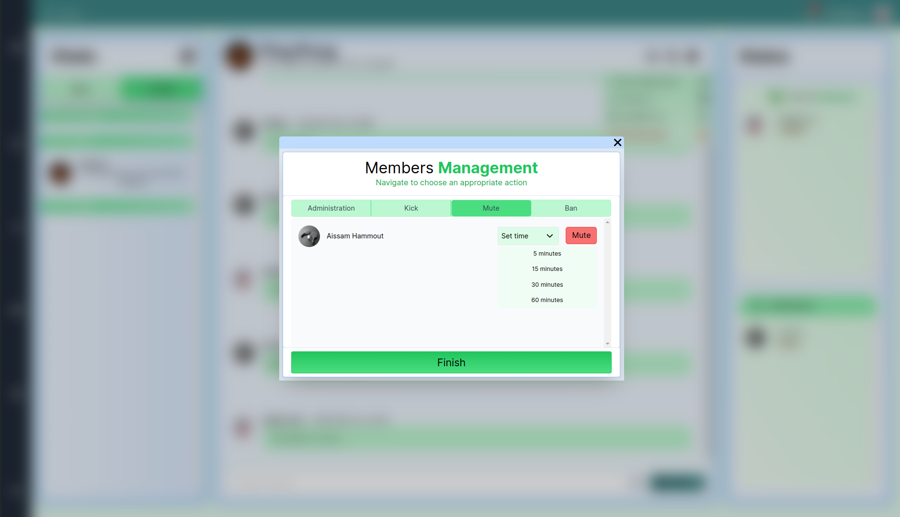
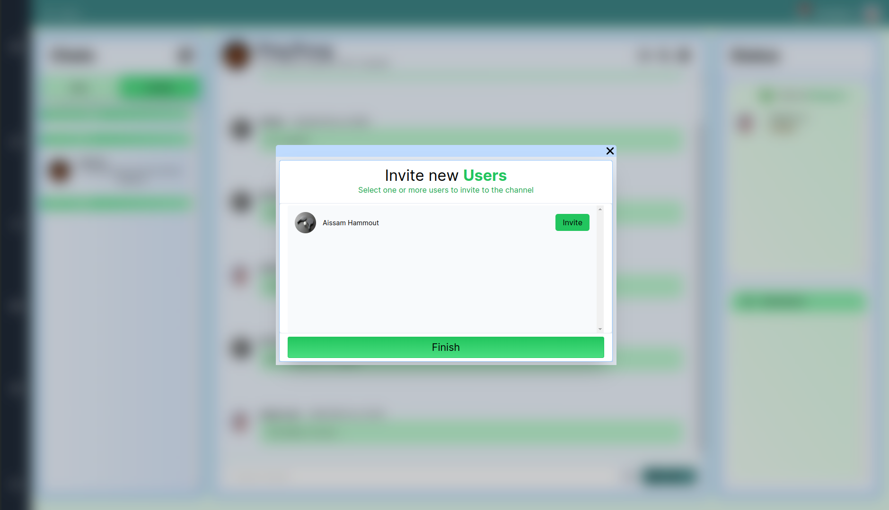

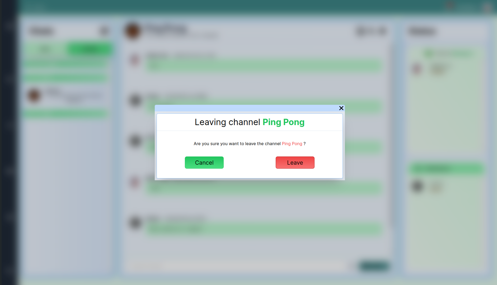

